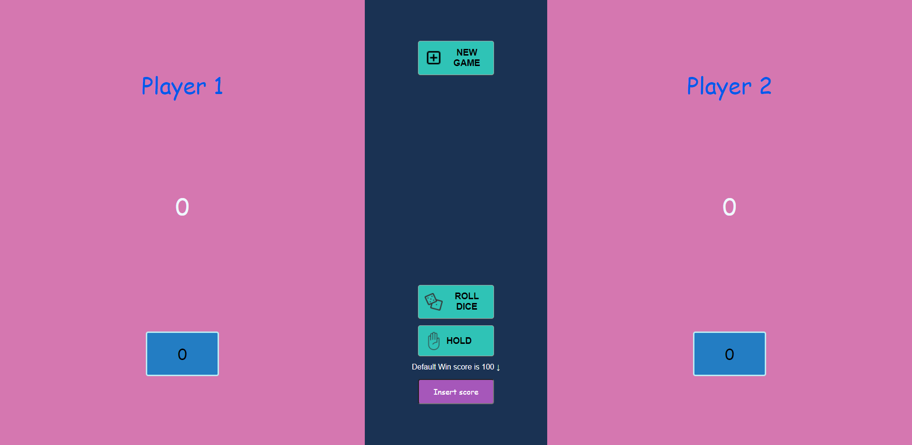
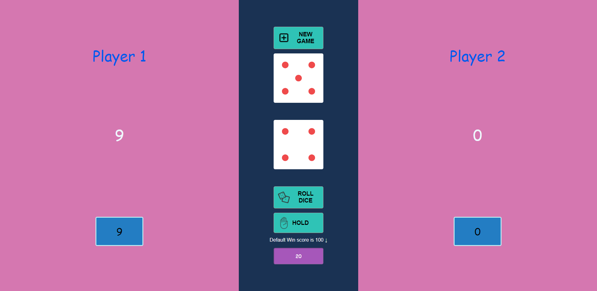
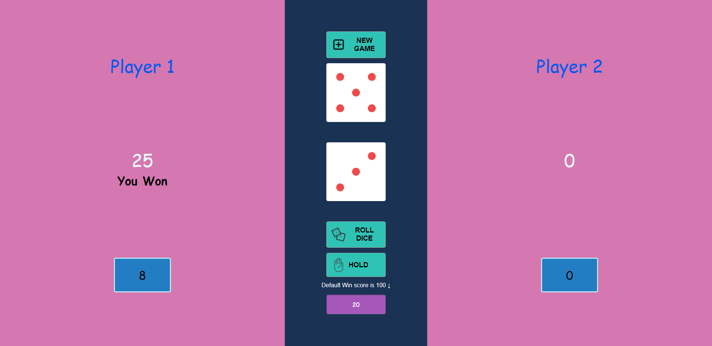

# Dise Game

### **Rules and goals**

A two-player dice game.

The player who manages to reach the target number of points first is the winner.

The default number of points for victory is 100, you can change the number of points for victory in the input at the beginning of the game.

Each player presses the roll dice button in is turn, the turn continues as long as the result is not double.

If the result is double, the turn automatically goes to the opponent.

A player can give up his turn by pressing the HOLD button and the turn will go to his opponent

### **Design**

- Using Design pattern of State
- The core of the game code is in the APP component.
- The button and input components are auxiliary components
- The player and dice components are intended for visual display on the screen

### **Technology used**

- This game was build in RReact Class components, HTML, CSS

- The game is fully responsive.

### Start Page

### Play stage

### Win Stage

### Video

**You can see the steps of the game here ↓**
